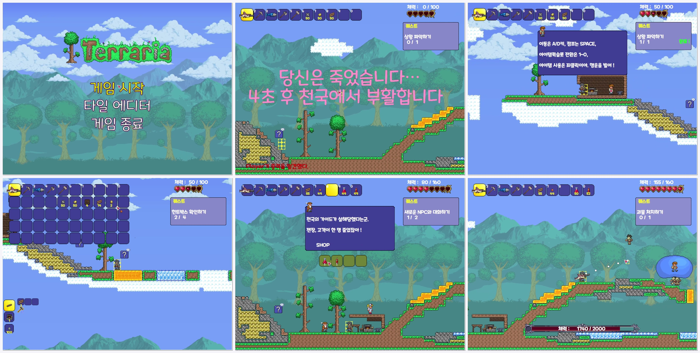

# WinAPI2D_Terraria_Clone_Project(테라리아 모작)

> Terraria의 핵심 메커니즘을 C++/WinAPI로 재구현한 2D 타일 기반 샌드박스 게임

## 📌 프로젝트 개요

- **개발 기간**: 2024.10.20 ~ 2024.11.07 (지속적 업데이트 중)
- **개발 환경**: Visual Studio (Win32/x86)
- **사용 기술**: C++, WinAPI
- **프로젝트 목적**: 2D 게임 개발의 핵심 메커니즘 학습 및 저수준 그래픽 프로그래밍 경험

## 🎮 주요 기능

### 타일 시스템
- 16x16 픽셀 타일 기반 맵 구성
- 블록 설치/파괴 및 주변 타일에 따른 스프라이트 자동 갱신
- 최초 1회 인스턴스 후 옵션값으로 블록 설치/삭제 등 관리
- Off-screen 컬링 및 Active 상태 관리를 통한 렌더링 최적화

### 인벤토리 & 크래프팅
- 퀵슬롯(상시 UI) 및 가방슬롯(토글) 시스템
- 마우스 기반 스왑, 버리기
- Map 컨테이너 기반 레시피 관리 및 재료 보유 여부에 따른 제작 가능 목록 표시
- 아이템 중첩 및 빈 슬롯 확인 로직

### 충돌 처리
- **예측 충돌 시스템**: 속도에 따라 다음 위치를 예측, 충돌하지 않을 때까지 이진 탐색으로 속도를 줄여나가며 터널링 방지
- Rect 기반 캐릭터-몬스터, 투사체 충돌 처리
- CollisionMsg 구조체를 통한 충돌 정보 전달 및 OnCollision 함수 실행

### 아이템 시스템
- ItemKey(ItemID, ItemSubID, ItemCode) 기반 아이템 식별
- 가상함수를 통한 아이템별 고유 데이터 초기화
- 아이템 정보만을 이용하여 객체 없이 Rendering 지원(인벤토리, 크래프팅 등)
- 필드 아이템의 중력 적용 및 플레이어 추적(자석 효과)

### NPC 상호작용
- 범위 내 NPC 우클릭 시 대화 시스템 및 NPC 기능 수행을 위한 버튼 출력
- 상점 기능: 구매/판매, 동전 아이템 기반 거래
- 회복 기능: 동전 소비를 통한 체력 회복

### 기타 시스템
- Boss 및 Minion의 상태 기반 AI 패턴
- 무한 스크롤 배경, 타일 에디터
- 폰트 적용 UI (말풍선, 퀘스트 텍스트 등)

## 🏗️ 아키텍처

### 클래스 구조
- **단일 상속 구조**: 모든 게임 오브젝트는 `CObj` 추상 클래스 상속
- **2차 추상층**: `CCharacter`, `CTile`, `CItem`, `CUI`, `CEffect` 등
- **싱글톤 매니저 패턴**: 각 오브젝트 타입별 전용 매니저 클래스
- **추상 팩토리 패턴**: `CAbstractFactory` 템플릿을 통한 객체 생성

### 최적화 기법
- **Flyweight 패턴**: 자주 사용되는 이미지를 static 멤버로 캐싱
- **Off-Screen 컬링**: 화면에 보이는 타일만 렌더링
- **조건부 렌더링**: 블록/벽지가 없는 타일은 Active=false로 스킵

## 🚀 실행 방법

1. Visual Studio에서 프로젝트 열기
2. Win32(x86) 플랫폼으로 빌드
3. 실행

## 💡 배운 점

- WinAPI의 핵심 자료형 및 함수 활용 능력
- 다양한 역할의 클래스 설계 및 관리 경험
- 게임 루프 구조와 함수 호출 순서의 중요성 이해
- 성능 프로파일링을 통한 병목 지점 파악 및 최적화 전략 수립
- 예측 충돌을 통한 터널링 해결 등 물리 시뮬레이션 문제 해결
- 메모리 누수 및 비정상 동작에 대한 디버깅 경험

## 🔧 개선 계획

- [ ] 장비 슬롯 시스템 추가
- [ ] 보조 이동 수단(갈고리, 마인카트 등) 구현
- [ ] Alpha-Blending 적용으로 투명도 표현
- [ ] 단차 자동 오르기 등 이동 로직 개선
- [ ] Effect 다양성 및 디테일 강화

## 📄 라이선스

이 프로젝트는 학습 목적의 모작 프로젝트입니다.

---

<!-- 선택사항: 기술 스택 뱃지 추가 -->
<!--  -->
<!--  -->
